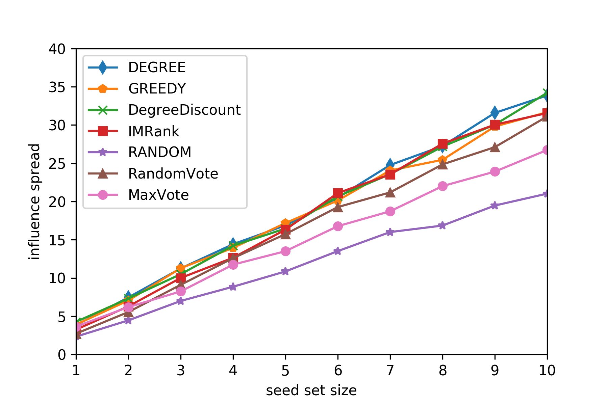

## 影响力最大化与传播模型

影响力最大化源自许多现实应用场景，一个典型的例子是病毒营销。这个问题可以描述为，向一定数量的具有一定影响力的人群推广某样商品，接下来让商品信息在社交网络中传播，让更多的人知道并愿意购买该商品以带来更大收益。

因为涉及社交网络，所以影响力最大化问题可以用图的语言来表述。设人际关系网络为$G=\{V,E\}$，其中每一个节点$v\in V$是一个独立的个体，每个个体有激活和未激活两种状态，未激活节点$u$会被已激活节点$v$影响而变为激活状态，$v$激活$u$的概率为$p_{vu}$。设初始化$k$个激活节点组成的集合为$S \sub V$，则经过数次传播后，会有部分节点被这些节点直接或间接激活，设最终处于激活状态的节点数为$f(S)$。则影响力最大化问题的数学形式为：
$$
\begin{equation}
\begin{split}
\max_S f(S)\\
i.e.\;|S|=k
\end{split}
\end{equation}
$$
已激活节点激活未激活节点一般有线性阈值（Linear Threshold，LT）和独立级联（Independent Cascade，IC）两种传播模型。LT模型由未激活节点的所有已激活近邻到它的边权值和决定是否激活该节点，IC模型每个已激活节点$u$尝试以概率$p_{uv}$激活其邻接节点$v$，这里我们使用IC模型作为我们的传播模型。有了传播模型，我们就可以根据$S$得到$f(S)$。因为IC模型具有随机性，所以需要多次运行取平均值。

## 影响力最大化相关算法

一个最简单的影响力最大化算法是假设出度更大的节点具有更大的影响力，使用出度最大的$k$个节点进行初始化（算法1： DEGREE）。但是这种算法没有考虑节点间的相互影响，并且仅仅使得第一次传播时的效果最好。这样一个局部连接很密的群落中的节点会占据初始化集合中的大部分名额，导致其他区域的节点无法被影响。对算法1的一个简单的修改是，在将一个度最大的节点加入初始化集合$S$中后，因为其邻接节点无法再对其施加影响降低临接节点的影响力（算法2： DegreeDiscount^[1]^）。

算法2在一定程度上考虑了节点间的相互影响，但是仍然不能仅仅通过$S$中节点的出度预见更多次传播后的结果。

为了使得算法能够预见初始化$S$后多次传播后的结果，最简单的方法是初始化后使用IC模型模拟一轮传播，基于这个想法提出了贪心算法（算法3： GREEDY）。即先根据爆发结果选择前$i$个初始化节点，在加入第$i+1$个节点时使其和前$i$个节点组成的集合总激活数最大，即
$$
\begin{equation}
\begin{split}
\max_{v_{i+1}} f(S_i\cup \{v_{i+1}\})\;,\;v\in V-S_i
\end{split}
\end{equation}
$$
这种算法虽然能够根据多次迭代后的结果评估出$S$的影响力，但是由于IC模型的不确定性，需要多次运行已找出平均激活数最多的节点组合并且需要对所有节点进行遍历。尽管有一系列对贪心算法的优化算法，但是这种需要模拟一轮传播的方法和根据图中边的权值进行影响力计算的方法相比，运行时间仍然超出很多^[2]^。

我们将一种基于寻找自洽排序的算法作为此次报告的主要对比方法（算法4： IMRank^[3]^）。这是一种既考虑多次传播问题和节点间相互影响，并且不需要模拟传播的算法。其中表现最好的是使用节点度初始化影响力排名的方法，初始化影响力排名的同时，为所有节点初始化一个统一的边际影响力，每次迭代让影响力排名更高的节点向周围排名更低的节点收取边际影响力，并更具边际影响力重新排序。每次迭代边际影响力的更新方式为：
$$
\begin{equation}
\begin{split}
&M_r(v_{r_j})\leftarrow M_r(v_{r_j})+p(v_{r_j},v_{r_i})\times M_r(v_{r_i})\\
&M_r(v_{r_i})\leftarrow (1-p(v_{r_j},v_{r_i}))\times M_r(v_{r_i})
\end{split}
\end{equation}
$$
其中$M_r$为边际影响力，$r$为影响力排名。通过这种边际影响力的收取，社交网络上的每个局部都会把影响力集中到该局部的少量节点上，防止了密集局部节点占去初始化集合大部分名额的问题。

除了以上算法外，我们再加上随机初始化的方法（算法5： RANDOM）作为最后一种对比方法，作为我们方法的一个小目标。

## 影响力选举算法

以上方法几乎基于了一个正向的想法，即一个节点的影响力由该节点被激活后能激活多少个节点决定。反过来，节点$u$的影响力，也由如果节点$v$被激活了，那么$v$有多大概率是由$u$激活的决定。这样，对于社交网络中的每一个节点，它都可以给出它认为影响力最大的节点。好像每个节点都做了一次投票，最终的初始化集合由投票结果决定。基于这一基本思想，我们可以提出了一种随机性算法（算法6： RandomVote）和一种确定性算法（算法7：MaxVote）。

### RandomVote

当一个节点$u$被激活时，它是由最初被激活的节点$v$沿着一条传播路径去激活的。那么对于$u$来说，影响力最大的节点是能够使这条路径概率最大化的起始节点，但是这样一个概率是很难直接算出的。所以考虑将图中所有的边反向，从$u$开始进行随机游走，这样可以回溯得到一条近似的传播路径，这条路径上的点即为$u$随机选出的点。虽然单看一条随机路径并不能得到太多有用信息，但是我们可以随机选很多点，对每个点随机生成相同长度的传播路径。根据对大量路径的统计，我们可以得到被选择次数最多的前$k$个点，这$k$个点即为所有节点随机投票选举出的初始化节点。

### MaxVote

一个社交网络可以由一个邻接矩阵$A$表示，其中$A_{vu}=p_{vu}$。邻接矩阵的幂$A^n$中每个元素$A^n_{vu}$的含义为从$v$到$u$长度为$n$的路径的概率。故我们可以构建邻接矩阵，对于每个节点$u$，选出其一定长度内每个长度路径中概率最大的连接节点。这个过程可以用简单的矩阵乘法表示，即：
$$
\begin{equation}
\begin{split}
MaxVote^n(u)={\arg \max}_{v\in V}A^n_{vu}
\end{split}
\end{equation}
$$
其中，为了在路径中去掉起点，每次乘积后置$A^n$的对角元素为0。根据所有节点的选取结果，得到被选择次数最多的前$k$个点，这$k$个点即为所有节点确定性投票选举出的初始化节点。

## 实验与结论

我们使用以上算法和相同实验条件在课程提供的数据集上进行实验，数据集的节点关系如图1所示，图中不存在孤立节点。

分别使用这几种算法选出大小为1-10的初始节点集合。之后使用IC模型，使用选出的初始化集合，模拟100轮传播，计算传播数量的平均值和标准差。其中贪心算法选取是基于100轮模拟结果给出的，因为贪心算法运行时间和重复模拟次数有关，而其他算法重点都不是运行时间，所以这里不对运行时间进行对比。每种方法选出的初始化集合对应扩散数量结果如图2所示。

从图中可以看出我们的方法未能超过除了随机初始化方法之外的所有方法。虽然如此，但超过了随机初始化方法说明我们的想法还是起了有一定的作用，只是还需要改进。

## 参考文献

[1] Chen W, Wang Y J, Yang S Y. Efficient Influence Maximization in Social Networks[J]. KDD, 2009.

[2]  Kempe D . Maximizing the spread of influence through a social  network[J]. Proc.of Acm Sigkdd Intl Conf.on Knowledge Discovery &  Data Mining, 2003.

[3] Cheng S Q, Shen H W, Huang J M, et al. IMRank: Influence Maximization via Finding Self-Consistent Ranking[J]. SIGIR, 2014.